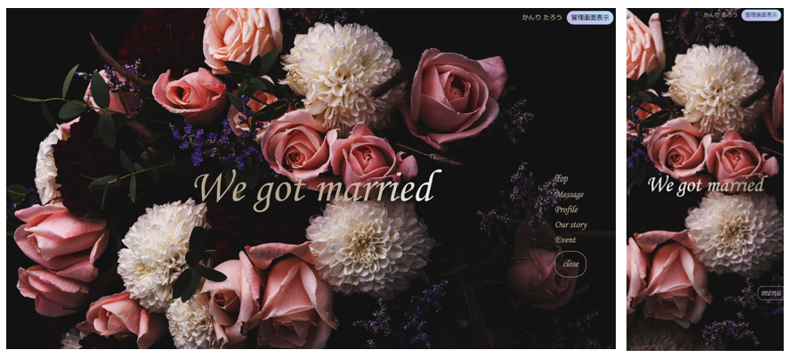
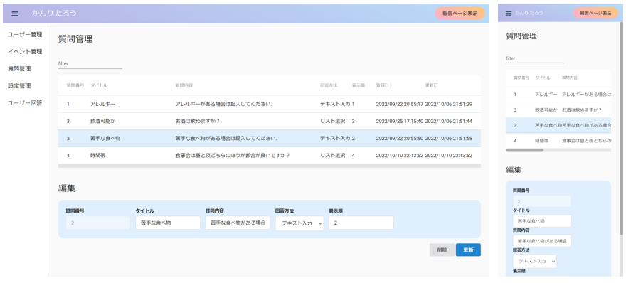
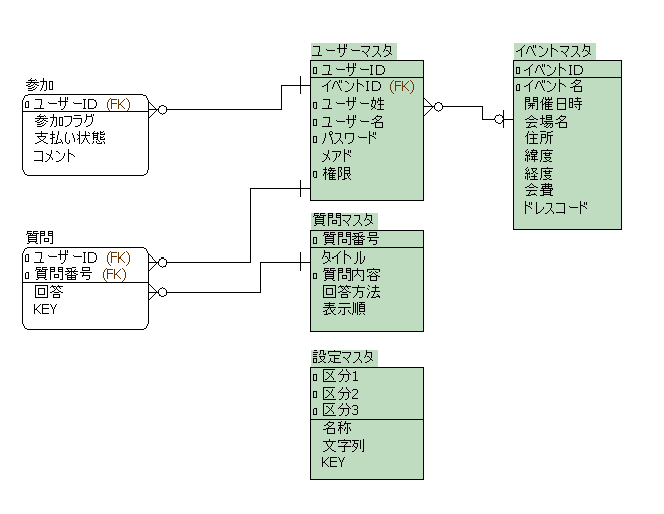

# 結婚報告・web招待状

## URL

**[招待状画面(テストイベント参加ユーザーの表示)](https://wedding-front.herokuapp.com/#/main?isTest=true)**

 >
 >イベント参加ユーザーでログインすることにより、ページ最下部エリアが **Event(参加イベントの詳細)**　となります。
 >
 >上記URLからの遷移時は、デフォルトでテストイベント参加ユーザーとなっています。
 >
 >
 >※報告のみユーザーの場合は、ページ最下部エリアが **Sincerely(締めの挨拶)** となります。
 >
 >**[招待状画面(報告のみユーザーの表示)](https://wedding-front.herokuapp.com/#/main?onlyRepo=true&&isTest=true)**
 >
 >上記URLからの遷移時は、デフォルトで報告のみユーザーとなります。

 

**[管理画面](https://wedding-front.herokuapp.com/#/manageQuestion)**
 >管理ユーザーでログインすることにより、ユーザー管理画面の表示、各画面のデータ操作が可能になる
 

__現在iosでの表示で、背景画像が拡大されてしまう・パララックス表示が正しく表示されないという不具合を確認しています。__
__鋭意改修中です。__
__android、windowsでは動作確認済みです。__

 

## イメージ図

**招待状画面(トップ)**

**管理画面(質問管理画面)**

## 概要

結婚報告と、それに伴い食事会を実施したいときに、出欠の確認や出席者へのアンケート(食のアレルギーや好みなど)を管理することができます。
 

## 制作背景
​
結婚準備をしている中で、ふと、新郎新婦お互いの知人・友人にどのように結婚報告をするか、悩みました。
  
遠方に住んでいたり、コロナ化となったことでしばらく連絡が取れていなかった人もおり、

相手との出会いや結婚に至った経緯、そもそも相手がどんな人なのか等、伝えたいことや聞かれるであろうことは沢山あるのに、

それら詳細を各々が知人一人ひとりに連絡を取って伝えるのは大変だな...という思いがあったからです。
  
また、一部の共通の友人を集めて食事会を開催したいと考えていたため、招待客の参加可否や苦手な食べ物がないか等のアンケートを取らないといけないという手間も感じていました。
  
そこで、結婚の報告と、新郎新婦の紹介や二人のストーリー、食事会への招待客にはアンケート回答フォームを備えた当アプリケーションを作成しました。
  

## 使用技術

**フロントエンド**
- Angular 14.2.3
- Angular CLI 14.2.3
- HTML/CSS

​**バックエンド**
- Python 3.9.8
- Django 4.1
- Django REST Framework 3.13.1

**Webサーバー**
- Node 14.17.1

**アプリケーションサーバー**
- gunicorn 20.1.0

**データベース**
- PostgreSQL 14.2

## 主な機能

**SPA**
- AngularとDjango REST Framework を使用することでフロントエンドとバックエンドを分離

**招待状画面**
- ログイン機能
    - イベント参加ユーザーはログインすることでイベント情報の詳細表示や出欠回答が可能
    - テストイベント参加ユーザー、報告のみユーザーは、リンクのパラメータを変えることで切替え
- トップへ遷移機能
    - ボタンクリックにより画面最上部へ遷移
- メニュー機能
    - ボタンクリックにより該当箇所へ遷移
- 管理画面表示機能(管理ユーザーのみ)
    - ボタンクリックにより、別ウィンドウで管理画面を表示
- マップ表示機能(イベント参加ユーザーのみ)
- フォーム入力機能(イベント参加ユーザーのみ)
    - イベント出席を選択時は質問回答フォームを表示
    - イベント欠席を選択時はコメント入力フォームのみを表示
        - 回答済みの場合は、回答の確認・更新が可能
- ログアウト機能

**管理画面**
- ログイン機能
    - 管理ユーザーでログインすることでユーザー管理画面の表示、全画面のデータ登録・更新・削除が可能
- 並び替え機能
- 絞り込み機能
- 登録機能(管理ユーザーのみ)
- 更新機能(管理ユーザーのみ)
- 削除機能(管理ユーザーのみ)
- 招待状ページ表示機能
    - ボタンクリックにより、別ウィンドウで招待状ページを表示
- ログアウト機能    

**その他**

- レスポンシブ対応

## こだわった部分
招待状ページのUXです。

ユーザーがわくわくしながら見れるようなサイトにしたかったため、**GSAP(GreenSock Animation Platform)** を使用してアニメーション表示を盛り込みました。

**ログイン画面**では、フォームの周りを花の画像が円状に回転し、そのうちの好きな花の画像をタップすることがログインのトリガーとなります。

**メイン画面のProfile部分** では、スクロール量に応じてバラの画像が回転します。

## 残課題
- ログイン状態保持
- 管理画面のpipe作成
- googleマップの表示修正

## ER図

